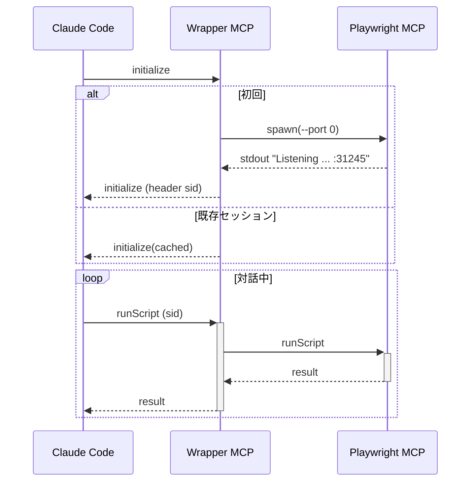

# 設計書（Ver 1.1）

> **対象読者**
> フルスタック／DevOps レベルの OSS エンジニアを想定。Node.js/TypeScript で実装する前提で記述。

## 結論 ― セッション単位で完全に分離できます

ラッパー MCP は **`Mcp-Session-Id`** をキーに **Registry** を保持し、未登録セッションが来た瞬間に `playwright-mcp --port 0` を起動します。
したがって **Claude Code の "1 セッション = 1 Playwright MCP プロセス"** が保証されます。既存セッションからの後続リクエストは同じ子プロセスにルーティングされるため混線は起こりません。

---

## 1. 用語

| 略語                 | 意味                                                |
| ------------------ | ------------------------------------------------- |
| **Claude Code**    | Anthropic CLI/VSCode 拡張など、エディタ側エージェント             |
| **Playwright MCP** | `npx playwright-mcp` が提供するブラウザ操作サーバ               |
| **Wrapper MCP**    | 本設計で新規に実装するプロセス分離・ルーティング層                         |
| **sid**            | `Mcp-Session-Id`（UUID）＝ Claude Code が会話ごとに帯同する識別子 |

## 2. 全体構成図

```
┌────────────┐ 1. initialize         ┌───────────────┐   spawn + stdout   ┌───────────────┐
│ Claude Code│──────────────────────▶│ Wrapper   MCP │━━━━━━━━━┓         │ Playwright MCP│
└────────────┘<──2. sid 返却────────└───────────────┘         ┃browse RPC└───────────────┘
                                      ▲ 3. RPC Proxy ┃
                                      ┗━━━━━━━━━━━━━━┛
```

* **1 セッション開始**: `initialize` 受信 → sid 生成 → Playwright 起動
* **3 プロキシ**: 以降の RPC/SSE は sid ↔ port で多重化

## 3. Wrapper MCP 詳細設計

### 3.1 起動

```bash
wrapper-mcp --port 4000
```

* Fastify + `@fastify/http-proxy` をベースに実装
* 127.0.0.1 バインド（外部公開時は Nginx/TLS 前段）

### 3.2 セッション処理フロー（擬コード）

```ts
if (!sid) {       // 新規セッション
  sid = uuid.v4();
  res.setHeader('Mcp-Session-Id', sid);

  {port,proc} = await launchWorker();   // --port 0 で起動し stdout から番号取得
  registry[sid] = {port,proc,last:now};
}
proxy(req, `http://127.0.0.1:${registry[sid].port}/mcp`);
registry[sid].last = now;
```

### 3.3 子プロセス生成

```ts
spawn('npx',['playwright-mcp','--port','0'], {stdio:['ignore','pipe','ignore']});
stdout.once('data', line => {
  const m = line.toString().match(/:(\d+)\s*$/);   // 例: …Listening on http://127.0.0.1:31245
  port = Number(m[1]);
});
```

### 3.4 クリーンアップ

* `lastSeen` から **60 s** 無通信で `SIGTERM` → 30 s 後 `SIGKILL`
* エッジケース: Claude Code が IDE を強制終了した場合もタイムアウトで回収

## 4. Playwright MCP 側要件

| 項目   | 設定値                                                        |
| ---- | ---------------------------------------------------------- |
| 引数   | `--port 0 --browser chromium --headless`                   |
| ロギング | 起動時に **"Listening on http\://…\:PORT"** を 1 行だけ stdout に出す |
| 終了   | SIGTERM 受信 ⇒ グレースフルシャットダウン                                 |

## 5. プロトコル仕様

| HTTP ヘッダー        | 意味                     | 送信主体              |
| ---------------- | ---------------------- | ----------------- |
| `Mcp-Session-Id` | UUIDv4                 | → Claude Code（自動） |
| `Origin`         | `null` 禁止、`file://` 防止 | → Wrapper で検証     |

## 6. シーケンス（代表ケース）



## 7. セキュリティ

1. **127.0.0.1 リッスン** … ラップ外に直接さらさない
2. **Origin チェック** … DNS Rebinding 防御
3. **Port 0 使用** … 衝突リスク皆無、OS が空きを保証
4. **最小権限** … Playwright は `--disable-gpu` 等でサンドボックス可

## 8. 導入手順

```bash
# 1. ラッパー MCP インストール
npm i -g wrapper-mcp   # ← 本実装をパッケージ化

# 2. ラッパー起動
wrapper-mcp --port 4000 &

# 3. Claude Code 登録
claude mcp add --transport http browser http://127.0.0.1:4000/mcp
```

## 9. テスト計画

| ID | シナリオ                        | 期待結果                                                          |
| -- | --------------------------- | ------------------------------------------------------------- |
| T1 | 2 つの VSCode ウィンドウで同時に新規会話開始 | Wrapper が 2 つの sid を発行し、`lsof -i:4000` で Playwright が 2 ポート開く |
| T2 | 一方を /exit → 60 s 待機         | 対応 Playwright プロセスが kill＝`ps` に残らない                           |
| T3 | 100 並列セッション                 | エラー無し、ポート衝突無し、メモリ使用 < 800 MB                                  |

## 10. 既知の課題 / 今後の改善

* **stdout 解析失敗時**: タイムアウト 8 s → リトライまたは 50x を返す
* **大量セッション保持**: `LRU + spool` を導入して上限数を制御予定
* **Windows 対応**: `lsof` 依存を避け、`netstat -ano` にフォールバック

---

### まとめ

* Claude Code の **セッション単位で完全分離された Playwright MCP** を自動生成し、
  OS 任せの空きポートを安全に取得するアーキテクチャを確立。
* ラッパー MCP は軽量 300 行程度で実装可能、依存は Node.js と Playwright だけ。

この内容で問題なければ実装に進めます。追加要望があれば教えてください！