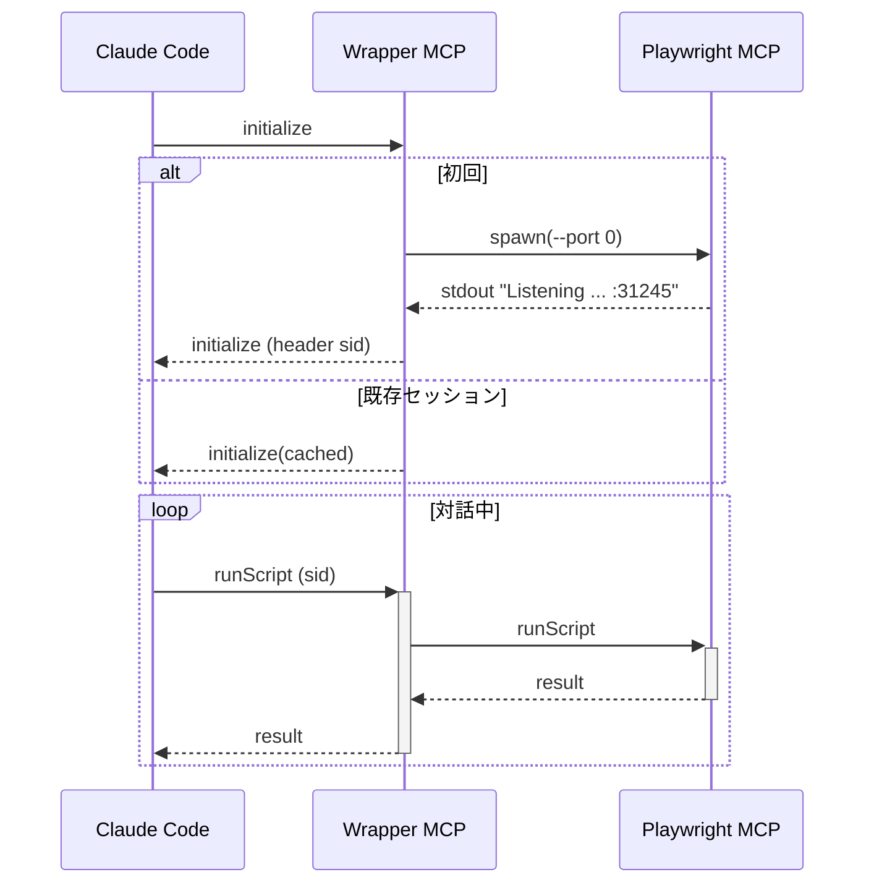

# 設計書（Ver 2.0）

> **対象読者**
> フルスタック／DevOps レベルの OSS エンジニアを想定。Node.js/TypeScript で実装する前提で記述。

## 結論 ― エンタープライズグレードのセッション分離を実現

ラッパー MCP は **`Mcp-Session-Id`** をキーに **Registry** を保持し、未登録セッションが来た瞬間に `playwright-mcp --port 0` を起動します。
**堅牢なポート検出**、**リソース管理**、**エラーハンドリング**、**クロスプラットフォーム対応**により、プロダクション環境でも安定動作する **"1 セッション = 1 Playwright MCP プロセス"** を保証します。

---

## 1. 用語

| 略語                 | 意味                                                |
| ------------------ | ------------------------------------------------- |
| **Claude Code**    | Anthropic CLI/VSCode 拡張など、エディタ側エージェント             |
| **Playwright MCP** | `npx playwright-mcp` が提供するブラウザ操作サーバ               |
| **Wrapper MCP**    | 本設計で新規に実装するプロセス分離・ルーティング層                         |
| **sid**            | `Mcp-Session-Id`（UUID）＝ Claude Code が会話ごとに帯同する識別子 |

## 2. 全体構成図

```
┌────────────┐ 1. initialize         ┌───────────────┐   spawn + stdout   ┌───────────────┐
│ Claude Code│──────────────────────▶│ Wrapper   MCP │━━━━━━━━━┓         │ Playwright MCP│
└────────────┘<──2. sid 返却────────└───────────────┘         ┃browse RPC└───────────────┘
                                      ▲ 3. RPC Proxy ┃
                                      ┗━━━━━━━━━━━━━━┛
                                      
                                    ┌─────────────┐
                                    │  Monitoring │━━ Metrics/Health
                                    └─────────────┘
```

* **1 セッション開始**: `initialize` 受信 → sid 生成 → Playwright 起動
* **3 プロキシ**: 以降の RPC/SSE は sid ↔ port で多重化
* **監視**: メトリクス収集とヘルスチェック

## 3. Wrapper MCP 詳細設計

### 3.1 起動

```bash
wrapper-mcp --port 4000 --max-sessions 50 --session-timeout 60
```

* Fastify + `@fastify/http-proxy` をベースに実装
* 127.0.0.1 バインド（外部公開時は Nginx/TLS 前段）
* 設定可能なリソース制限とタイムアウト

### 3.2 セッション処理フロー

```ts
class SessionHandler {
  async handleRequest(req: Request, res: Response) {
    const sid = req.headers['mcp-session-id'] || uuid.v4();
    
    if (!this.registry.has(sid)) {
      // リソースチェック
      await this.resourceManager.ensureCapacity();
      
      // 新規セッション作成
      const session = await this.sessionSpawner.spawnWithRetry({
        port: 0,
        browser: 'chromium',
        headless: true
      });
      
      this.registry.set(sid, session);
      res.setHeader('Mcp-Session-Id', sid);
    }
    
    const session = this.registry.get(sid);
    await this.proxy(req, res, session.url);
    session.updateLastAccess();
  }
}
```

### 3.3 堅牢なポート検出

```ts
class PortDetector {
  private readonly strategies = [
    new StdoutParseStrategy([
      /Listening on http:\/\/[^:]+:(\d+)/,
      /Server started on port (\d+)/,
      /:\s*(\d+)\s*$/
    ]),
    new ProcessNetworkStrategy(), // lsof/netstat
    new HealthCheckStrategy()      // HTTP health probe
  ];
  
  async detectPort(proc: ChildProcess, timeout = 10000): Promise<number> {
    const deadline = Date.now() + timeout;
    
    for (const strategy of this.strategies) {
      try {
        const port = await strategy.detect(proc, deadline - Date.now());
        if (port && await this.verifyPort(port)) {
          return port;
        }
      } catch (error) {
        this.logger.debug(`Strategy ${strategy.name} failed:`, error);
      }
    }
    
    throw new Error('All port detection strategies failed');
  }
  
  private async verifyPort(port: number): Promise<boolean> {
    try {
      const res = await fetch(`http://127.0.0.1:${port}/health`);
      return res.ok;
    } catch {
      return false;
    }
  }
}
```

### 3.4 リソース管理

```ts
interface ResourceLimits {
  maxSessions: number;         // デフォルト: 50
  maxMemoryPerSession: number; // デフォルト: 100MB
  sessionQueueSize: number;    // デフォルト: 10
}

class ResourceManager {
  private activeSessions = new Map<string, Session>();
  private sessionQueue = new Queue<PendingSession>();
  private metrics = new MetricsCollector();
  
  async ensureCapacity(): Promise<void> {
    // セッション数チェック
    if (this.activeSessions.size >= this.limits.maxSessions) {
      await this.evictLeastRecentlyUsed();
      
      if (this.activeSessions.size >= this.limits.maxSessions) {
        throw new CapacityError('Session limit reached');
      }
    }
    
    // メモリ使用量チェック
    const memoryUsage = await this.metrics.getMemoryUsage();
    if (memoryUsage.total > this.limits.maxMemoryPerSession * this.limits.maxSessions * 0.8) {
      await this.performGarbageCollection();
    }
  }
  
  private async evictLeastRecentlyUsed(): Promise<void> {
    const sessions = Array.from(this.activeSessions.values())
      .filter(s => s.isIdle())
      .sort((a, b) => a.lastAccess - b.lastAccess);
    
    if (sessions.length > 0) {
      await sessions[0].terminate();
      this.activeSessions.delete(sessions[0].id);
    }
  }
}
```

### 3.5 エラーハンドリングとリトライ

```ts
class ResilientSessionSpawner {
  private circuitBreaker = new CircuitBreaker({
    failureThreshold: 5,
    resetTimeout: 30000,
    onOpen: () => this.logger.error('Circuit breaker opened')
  });
  
  async spawnWithRetry(config: SpawnConfig): Promise<Session> {
    return this.circuitBreaker.execute(async () => {
      const retryPolicy = new ExponentialBackoff({
        initialDelay: 100,
        maxDelay: 5000,
        maxAttempts: 3,
        factor: 2
      });
      
      return retryPolicy.execute(async (attempt) => {
        try {
          const session = await this.spawn(config);
          await this.waitForHealthy(session);
          return session;
        } catch (error) {
          this.handleSpawnError(error, config, attempt);
          throw error;
        }
      });
    });
  }
  
  private handleSpawnError(error: Error, config: SpawnConfig, attempt: number): void {
    if (error.code === 'EADDRINUSE') {
      config.port = 0; // OSに再割り当てさせる
    } else if (error.code === 'ENOMEM') {
      this.resourceManager.requestGarbageCollection();
    }
    
    this.metrics.recordSpawnError(error.code, attempt);
  }
}
```

### 3.6 クロスプラットフォーム対応

```ts
interface PlatformAdapter {
  getProcessPorts(pid: number): Promise<number[]>;
  killProcess(pid: number, signal: string): Promise<void>;
  checkPortAvailable(port: number): Promise<boolean>;
}

class PlatformAdapterFactory {
  static create(): PlatformAdapter {
    switch (process.platform) {
      case 'win32':
        return new WindowsAdapter();
      case 'darwin':
        return new MacOSAdapter();
      case 'linux':
        return new LinuxAdapter();
      default:
        return new UnixAdapter();
    }
  }
}

class WindowsAdapter implements PlatformAdapter {
  async getProcessPorts(pid: number): Promise<number[]> {
    const output = await exec(`netstat -ano | findstr ${pid}`);
    return this.parseNetstatOutput(output);
  }
  
  async killProcess(pid: number, signal: string): Promise<void> {
    const forceFlag = signal === 'SIGKILL' ? '/F' : '';
    await exec(`taskkill ${forceFlag} /PID ${pid}`);
  }
}
```

### 3.7 クリーンアップとライフサイクル

```ts
class SessionLifecycleManager {
  private cleanupInterval: NodeJS.Timer;
  private shutdownHandlers: Array<() => Promise<void>> = [];
  
  constructor(
    private registry: SessionRegistry,
    private config: { sessionTimeout: number }
  ) {
    this.setupCleanupInterval();
    this.setupShutdownHandlers();
  }
  
  private setupCleanupInterval(): void {
    this.cleanupInterval = setInterval(() => {
      this.cleanupIdleSessions();
    }, 10000); // 10秒ごと
  }
  
  private async cleanupIdleSessions(): Promise<void> {
    const now = Date.now();
    const sessions = this.registry.getAllSessions();
    
    for (const session of sessions) {
      if (now - session.lastAccess > this.config.sessionTimeout * 1000) {
        await this.terminateSession(session);
      }
    }
  }
  
  private async terminateSession(session: Session): Promise<void> {
    try {
      await session.terminate('SIGTERM');
      await this.wait(5000);
      
      if (session.isAlive()) {
        await session.terminate('SIGKILL');
      }
    } finally {
      this.registry.remove(session.id);
    }
  }
  
  async shutdown(): Promise<void> {
    clearInterval(this.cleanupInterval);
    
    // グレースフル期間を設定
    const gracePeriod = 30000;
    const deadline = Date.now() + gracePeriod;
    
    // 全セッションに通知
    const sessions = this.registry.getAllSessions();
    await Promise.all(sessions.map(s => s.notifyShutdown()));
    
    // 接続がドレインされるまで待機
    while (Date.now() < deadline && this.hasActiveConnections()) {
      await this.wait(100);
    }
    
    // 残存セッションを強制終了
    await Promise.all(sessions.map(s => this.terminateSession(s)));
  }
}
```

## 4. 監視と可観測性

### 4.1 メトリクス

```ts
class MetricsCollector {
  private metrics = {
    activeSessions: new Gauge({
      name: 'wrapper_active_sessions',
      help: 'Number of active Playwright MCP sessions'
    }),
    sessionCreations: new Counter({
      name: 'wrapper_session_creations_total',
      help: 'Total number of sessions created'
    }),
    sessionErrors: new Counter({
      name: 'wrapper_session_errors_total',
      help: 'Total number of session errors',
      labelNames: ['error_type']
    }),
    proxyLatency: new Histogram({
      name: 'wrapper_proxy_latency_seconds',
      help: 'Proxy request latency',
      buckets: [0.001, 0.005, 0.01, 0.05, 0.1, 0.5, 1]
    }),
    memoryUsage: new Gauge({
      name: 'wrapper_memory_usage_bytes',
      help: 'Memory usage per session',
      labelNames: ['session_id']
    })
  };
  
  async export(): Promise<string> {
    return prometheus.register.metrics();
  }
}
```

### 4.2 ヘルスチェック

```ts
app.get('/health', async (req, res) => {
  const health = {
    status: 'healthy',
    timestamp: new Date().toISOString(),
    checks: {
      sessions: {
        active: registry.size,
        limit: config.maxSessions,
        healthy: registry.size < config.maxSessions * 0.9
      },
      memory: {
        used: process.memoryUsage().heapUsed,
        limit: config.maxMemory,
        healthy: process.memoryUsage().heapUsed < config.maxMemory * 0.8
      },
      circuitBreaker: {
        state: circuitBreaker.state,
        healthy: circuitBreaker.state !== 'open'
      }
    }
  };
  
  const isHealthy = Object.values(health.checks).every(c => c.healthy);
  res.status(isHealthy ? 200 : 503).json(health);
});
```

## 5. Playwright MCP 側要件

| 項目   | 設定値                                                        |
| ---- | ---------------------------------------------------------- |
| 引数   | `--port 0 --browser chromium --headless`                   |
| ロギング | 起動時に **"Listening on http\://…\:PORT"** を 1 行だけ stdout に出す |
| 終了   | SIGTERM 受信 ⇒ グレースフルシャットダウン                                 |

## 6. プロトコル仕様

| HTTP ヘッダー        | 意味                     | 送信主体              |
| ---------------- | ---------------------- | ----------------- |
| `Mcp-Session-Id` | UUIDv4                 | → Claude Code（自動） |
| `Origin`         | `null` 禁止、`file://` 防止 | → Wrapper で検証     |

## 7. シーケンス（代表ケース）



## 8. セキュリティ

1. **127.0.0.1 リッスン** … ラップ外に直接さらさない
2. **Origin チェック** … DNS Rebinding 防御
3. **Port 0 使用** … 衝突リスク皆無、OS が空きを保証
4. **プロセス分離** … セッション間の完全分離
5. **リソース制限** … DoS 攻撃への耐性

## 9. 導入手順

```bash
# 1. ラッパー MCP インストール
npm i -g wrapper-mcp

# 2. 設定ファイル作成（オプション）
cat > wrapper-config.json << EOF
{
  "maxSessions": 50,
  "sessionTimeout": 60,
  "maxMemoryPerSession": 104857600,
  "logLevel": "info"
}
EOF

# 3. ラッパー起動
wrapper-mcp --port 4000 --config wrapper-config.json &

# 4. Claude Code 登録
claude mcp add --transport http browser http://127.0.0.1:4000/mcp

# 5. 監視（オプション）
curl http://127.0.0.1:4000/metrics  # Prometheusメトリクス
curl http://127.0.0.1:4000/health   # ヘルスチェック
```

## 10. テスト計画

| ID | シナリオ | 期待結果 |
| -- | ------- | ------- |
| T1 | 複数VSCodeウィンドウで同時セッション | 各セッションが独立したPlaywrightプロセスを持つ |
| T2 | セッションタイムアウト | 60秒後に自動クリーンアップ |
| T3 | リソース制限到達 | LRU退避が動作し、新規セッションが作成可能 |
| T4 | Playwright起動失敗 | リトライ後、適切なエラーメッセージ |
| T5 | 大量同時接続（100セッション） | リソース制限内で安定動作 |
| T6 | Windows/Mac/Linux環境 | 全プラットフォームで一貫した動作 |
| T7 | グレースフルシャットダウン | 既存セッションが適切に終了 |
| T8 | メモリリーク検証 | 長時間運用でメモリ使用量が安定 |

## 11. 実装優先順位

1. **Phase 1 - MVP（1週間）**
   - 基本的なHTTPプロキシ機能
   - セッション管理（作成・ルーティング）
   - stdoutベースのポート検出

2. **Phase 2 - 堅牢性（1週間）**
   - 複数ポート検出戦略
   - エラーハンドリングとリトライ
   - 基本的なリソース管理

3. **Phase 3 - プロダクション対応（1週間）**
   - クロスプラットフォーム対応
   - メトリクスとモニタリング
   - グレースフルシャットダウン

4. **Phase 4 - 拡張機能（2週間）**
   - セッション永続化
   - 分散環境対応
   - 高度なリソース管理

## 12. 既知の課題と今後の改善

* **セッション永続化**: 現状はメモリ内管理のため、Wrapper再起動で失われる
* **分散対応**: 単一インスタンスのみ（Redisベースの実装で解決予定）
* **認証**: 現状は認証なし（企業環境ではmTLS推奨）

---

### まとめ

Ver 2.0では、プロダクション環境での安定稼働を目指し、以下を実現します：

* **堅牢なポート検出**: 複数戦略によるフォールバック
* **リソース管理**: セッション数・メモリ制限、LRU退避
* **エラーハンドリング**: サーキットブレーカー、リトライ戦略
* **クロスプラットフォーム**: Windows/Mac/Linux対応
* **運用性**: メトリクス、ヘルスチェック、グレースフルシャットダウン

これにより、エンタープライズ環境でも安心して使用できる、Claude Code用のセッション分離ソリューションを提供します。